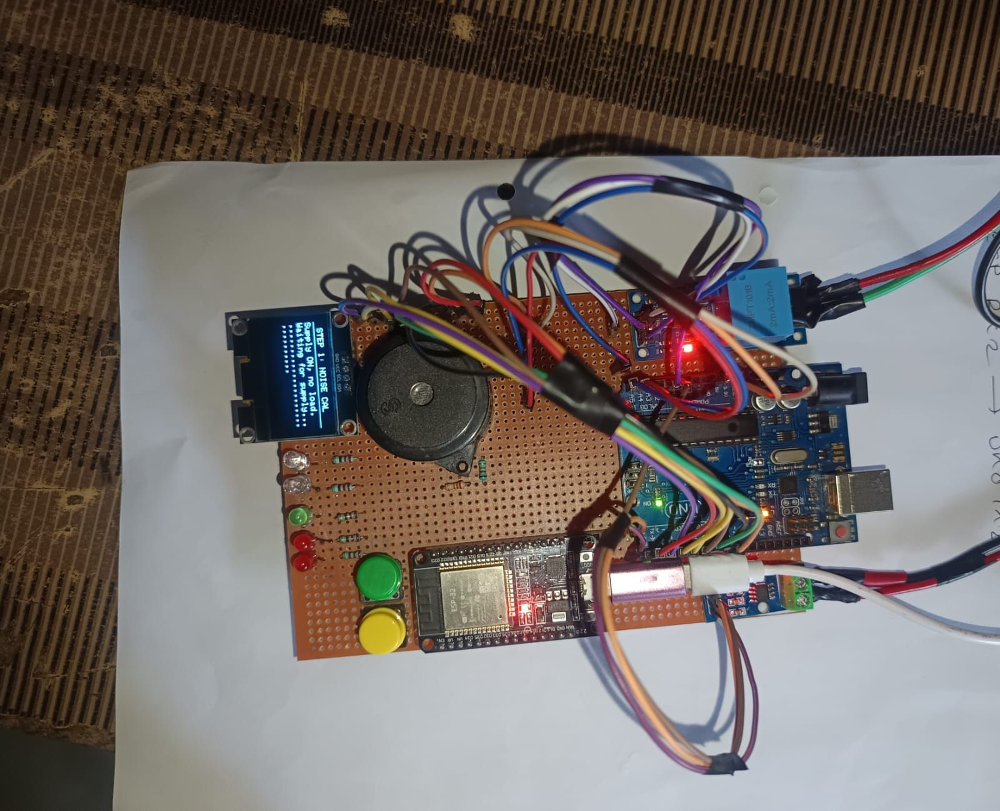
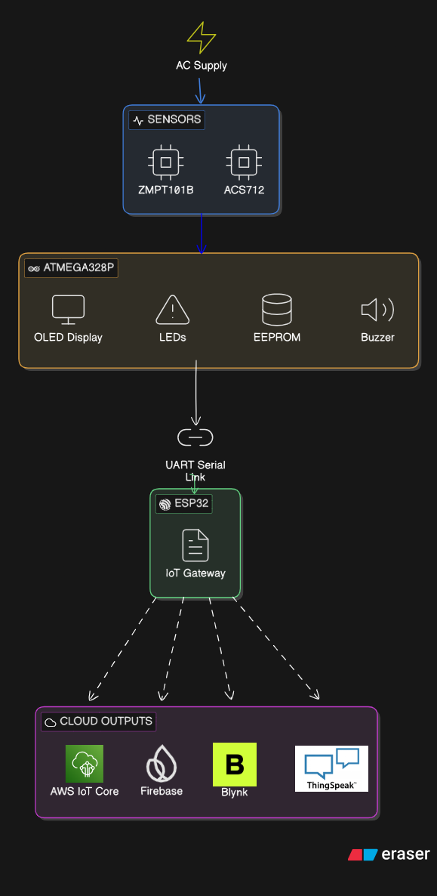
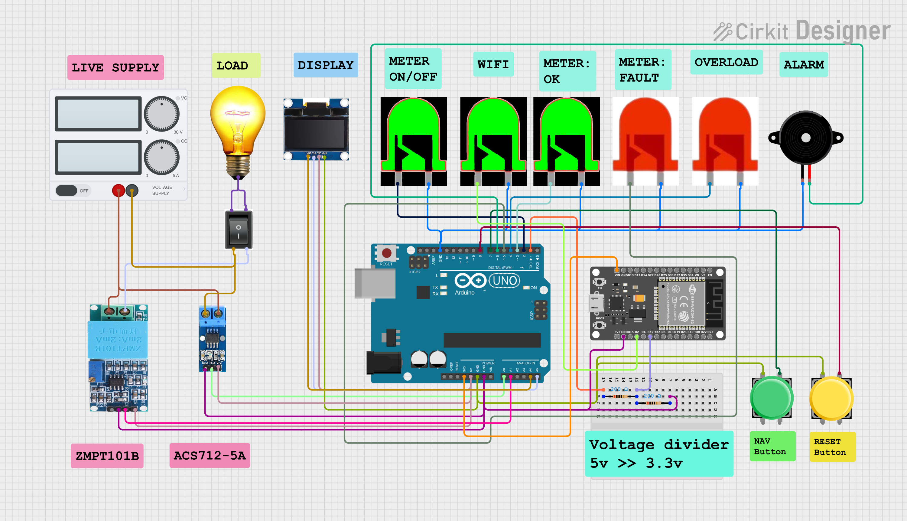

<div align="center">

# Smart Energy Meter using Arduino UNO & ESP32

### Multi-Cloud IoT Energy Monitoring System

Real-time electrical parameter monitoring with custom firmware-based power calculations, OLED visualization, overload protection, and cloud connectivity.


</div>

---

# Hardware Prototype

<p align="center">

</p>

---

# Project Overview

Conventional electricity meters only display the total energy consumed at the end of the billing cycle, giving users very little insight into how electricity is being used throughout the day.

This project presents a **Smart Energy Meter** capable of measuring electrical parameters in real time and making them available both locally and remotely through multiple IoT platforms.

Unlike many similar projects that depend on dedicated energy metering ICs, this system performs all electrical calculations directly in the firmware running on the **Arduino UNO (ATmega328P)**. The processed measurements are transmitted to an **ESP32**, which acts as an IoT gateway and securely uploads the data to multiple cloud platforms.

The separation of measurement and communication ensures that energy monitoring continues uninterrupted even if Wi-Fi connectivity or cloud services become unavailable.

---

# Key Features

- Real-time RMS Voltage Measurement
- Real-time RMS Current Measurement
- Real Power Calculation
- Apparent Power Calculation
- Reactive Power Calculation
- Power Factor Calculation
- Energy Consumption (kWh)
- Electricity Bill Estimation (₹8/unit)
- OLED Graphical Interface
- Animated Waveform Display
- UART Communication between Arduino & ESP32
- Multi-Cloud IoT Connectivity
- EEPROM Event Logging
- Overload Detection (>2000 W)
- Audible & Visual Fault Indication
- Persistent Event Storage after Power Failure

---

# System Architecture

<p align="center">

</p>

The system is divided into two independent processing units.

- **Arduino UNO** performs signal acquisition, RMS calculations, power analysis, energy computation, and OLED display management.
- **ESP32** handles Wi-Fi connectivity and cloud communication.

This modular architecture improves reliability because measurement continues even if the networking module disconnects.

---

# Circuit Diagram

<p align="center">

</p>

---

# Hardware Components

| Component | Purpose |
|------------|----------|
| Arduino UNO (ATmega328P) | Measurement & signal processing |
| ESP32 Dev Board | Wi-Fi & cloud communication |
| ZMPT101B Voltage Sensor | AC Voltage sensing |
| ACS712 Current Sensor | AC Current sensing |
| OLED Display | Local graphical display |
| EEPROM | Persistent overload logging |
| LEDs | Status indication |
| Piezo Buzzer | Overload alarm |
| Push Buttons | Navigation / Control |

---

# Electrical Parameters Measured

The firmware continuously measures and calculates:

- RMS Voltage (V)
- RMS Current (A)
- Real Power (W)
- Apparent Power (VA)
- Reactive Power (VAR)
- Power Factor
- Energy Consumption (kWh)
- Estimated Electricity Cost
- System Status

---

# Working Principle

1. Voltage is measured using the **ZMPT101B** sensor.
2. Current is measured using the **ACS712** sensor.
3. Arduino UNO samples both waveforms multiple times during every AC cycle.
4. Firmware calculates all electrical parameters without using a dedicated metering IC.
5. Results are displayed on the OLED display.
6. Processed values are transmitted over UART to the ESP32.
7. ESP32 uploads the data to multiple cloud services over Wi-Fi.

---

# OLED User Interface

The OLED provides five different display pages.

- Live Voltage, Current & Power
- Complete Power Analysis
- Energy Consumption & Electricity Bill
- System Health & Status
- Overload Event History

---

# 🚨 Safety Features

- Automatic overload detection above **2000 Watts**
- Buzzer alarm
- Red warning LED
- OLED warning screen
- EEPROM storage of overload events
- Data retained after power loss
- Normal/Fault status indication

---

# ☁ Cloud Integration

The ESP32 uploads a JSON payload approximately every **2 seconds** to multiple cloud platforms simultaneously.

| Platform | Purpose |
|-----------|----------|
| AWS IoT Core | Secure MQTT communication |
| Firebase Realtime Database | Mobile/Web applications |
| Blynk | Live dashboard |
| ThingSpeak | Data visualization & analytics |


---

# 📂 Repository Structure

```text
Smart-Energy-Meter
│
├── Arduino_UNO.ino
├── ESP32.ino
├── ESP32_AWS_only.ino
├── README.md
│
└── images
    ├── hardware_photo.jpeg
    ├── Architecture_Diagram.png
    └── Ckt_Diagram.png
```

---

# 🛠 Software & Technologies

- Arduino IDE
- Embedded C++
- ESP32 Wi-Fi Libraries
- MQTT Protocol
- HTTP REST APIs
- EEPROM Library
- Adafruit SH110X OLED Library
- AWS IoT Core
- Firebase Realtime Database
- ThingSpeak
- Blynk

---

# 🚀 Future Improvements

- Mobile application
- OTA firmware updates
- AI-based energy prediction
- Smart home integration


---

# 👨‍💻 Author

**Sahil Sambherao**

Electronics & Telecommunication Engineering

Passionate about **Embedded Systems, IoT, Firmware Development, and Edge Computing.**

---

## ⭐ If you found this project interesting, consider giving it a Star!
